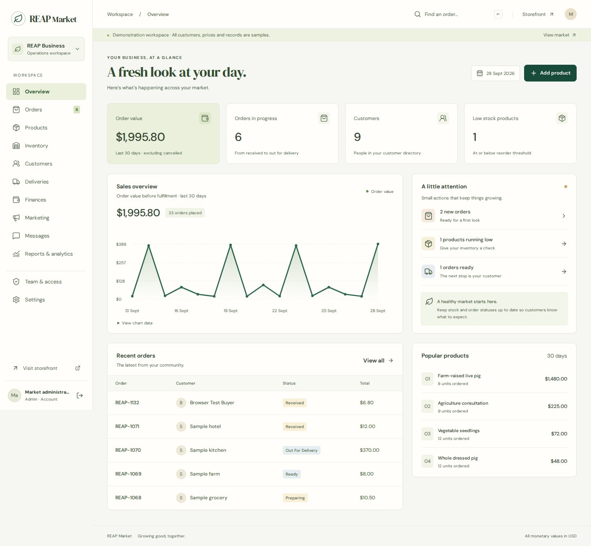

# REAP Market

A responsive agriculture storefront and operations workspace for **Restoration of Educational Advancement Programs (REAP)**, Bentol City, Liberia.

Built in the `tolbertinnovation-debug/REAP-M` repository. The supplied institutional reference is [reapwestafrica.org](https://www.reapwestafrica.org/). The product name is **REAP Market**; the brief's “RIP” is interpreted as REAP based on that reference.

To launch a live instance, use the [guided Render setup](docs/RENDER.md). It configures a paid web service and a persistent database disk; you enter administrator and business details privately in Render.

[](https://render.com/deploy?repo=https://github.com/tolbertinnovation-debug/REAP-M)

## Explore locally

Requires **Node 24.14 or later** and npm.

```bash
npm ci
npm run build
npm run demo
```

Open `http://localhost:3000`. Select **Staff workspace** in the footer and **Open admin demo**. Customer, sales, delivery and accountant demos are also available. The demonstration uses a separate persistent `data/demo.sqlite` database. All sample contacts use `example.test`. No payment is collected and external sending is disabled.

During frontend development, start `npm run demo` in one terminal and `npm run dev` in another. The Vite development server proxies API requests to port 3000. Set `PUBLIC_ORIGIN` to the development browser origin when submitting writes through Vite, e.g. `http://localhost:5173`. Production uses one origin for frontend and API.

## What works

| Area                | Implemented workflows                                                                                                                   |
| ------------------- | --------------------------------------------------------------------------------------------------------------------------------------- |
| Storefront          | Search, category filters, sorting, product details, basket, stock availability, promotions, pickup/delivery, preferred dates, checkout  |
| Customers           | Registration, sign in/out, password changes, account order history, private tracking codes, in-app customer/staff messages              |
| Orders              | Server-priced checkout, atomic stock reservations, duplicate-request protection, status transitions, cancellation and stock restoration |
| Inventory           | Product creation/editing, visibility, featured products, low stock thresholds, adjustments with reasons, movement history               |
| Customer management | Contact directory, order count, order history, order value, marketing consent, CSV export                                               |
| Deliveries          | Preparation/ready/dispatched board, driver assignments, completion updates                                                              |
| Finances            | Verified manual payments and refunds, partial payments, balance controls, expenses, printable invoices, cash ledger CSV                 |
| Marketing           | Campaign drafts, content copying, budgets, manually entered ad metrics, promotion codes with expiry and usage limits                    |
| Communication       | Customer inbox, staff replies, consent-checked message drafts, optional Resend email and Twilio SMS/WhatsApp adapters                   |
| Reporting           | Date-filtered order value, net receipts, expenses, cash surplus, product rankings, accessible chart data table                          |
| Administration      | Admin, manager, sales, dispatch and accountant roles; account activation; session revocation; audit history                             |

All financial amounts use **integer USD cents**. Stock and order quantities currently use whole selling units (including whole pounds). Final livestock sizes, meat weights and fulfillment arrangements must be confirmed before fulfillment.

## Screens

Screenshots captured from the running demonstration. All displayed customers, orders and prices are samples.




[Mobile storefront](docs/screenshots/storefront-mobile.jpg) · [Mobile dashboard](docs/screenshots/dashboard-mobile.jpg)

## Run a live instance

**This application needs a server. GitHub Pages alone cannot run the API, authentication or database.** Docker and an HTTPS reverse proxy configuration are included. Follow [DEPLOYMENT.md](docs/DEPLOYMENT.md).

Live startup does not create demo accounts, prices, contacts or stock. Enter REAP's approved catalogue through the admin workspace after configuring the first administrator. `DEMO_MODE=false` is the default. A database marked as demonstration data cannot be opened as a live database.

## Integrations and boundaries

- **Payments:** cash, bank transfer and mobile money are recorded after independent verification. No payment gateway charge, settlement, webhook or automatic reconciliation is claimed.
- **Messaging:** external messages require valid provider credentials and `ENABLE_OUTBOUND=true`. The interface records provider acceptance, not delivery confirmation. WhatsApp must meet the connected provider's sender, consent, conversation and template requirements. See [INTEGRATIONS.md](docs/INTEGRATIONS.md).
- **Advertising:** planning and manual performance reporting are implemented. Publishing posts, purchasing advertisements and synchronizing ad accounts require additional provider integration.
- **Bookkeeping:** cash receipts/refunds, expenses and open balances are implemented. This is not a full general ledger, inventory valuation, payroll or tax accounting package.
- **Hosting:** deployment files are included; the repository is not itself a provisioned production host. Set the domain, persistent storage, actual prices, delivery terms and provider accounts before launch.
- **Scale:** this release supports a single Node process backed by SQLite WAL. It is a modular starting point for a growing business, not a claim of unlimited scale. See the deployment guide for the multi-instance migration path.

## Verification

```bash
npm test
npm run build
npx playwright install chromium
npm run test:browser
```

The API suite exercises overselling, pricing tampering, role restrictions, CSRF, order privacy, payment limits, refunds, cancellation restoration, consent, database separation and reporting. Browser checks cover checkout and the desktop/mobile workspace. See [QA.md](docs/QA.md).

## Project layout

```text
src/             React storefront, workspace and styles
server/          Node HTTP API, SQLite schema, security and provider adapters
public/assets/   Self-hosted photos, logo, fonts and market icon
tests/           API and browser regression checks
docs/            Deployment, integration, architecture and QA notes
```

Photo and font sources are documented in [ASSETS.md](docs/ASSETS.md). Official REAP assets belong to their respective owner. Replace illustrative product photos with current REAP inventory photos before commercial use.
