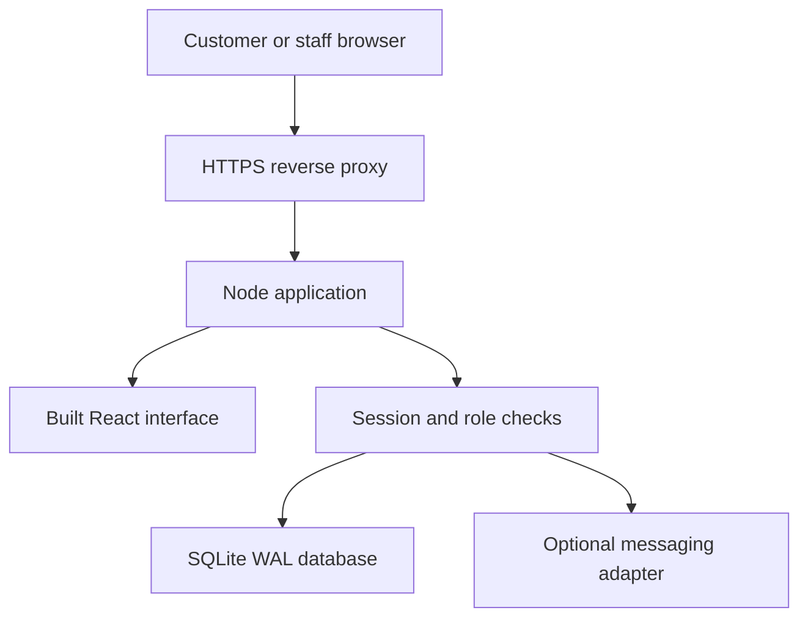

# Architecture

## Request path

The browser receives public catalogue data or data filtered for the authenticated role. It never receives credential hashes, provider secrets or another customer's account history.

## Transaction boundaries

Checkout validates products, availability, quantities, promotion limits and fulfillment, then recalculates prices on the server. Order insertion, stock decrement, movement entries, promotion redemption and the first order event commit together. A unique idempotency key prevents duplicate orders. A separate cryptographically random code grants guest tracking access; only its SHA-256 digest is stored.

Cancellation is permitted only through valid status transitions. Stock is restored in the same transaction. Recorded payments must be fully refunded first. A cancelled order cannot be cancelled twice or accept further payments. Payment/refund mutations check the net amount while holding the transaction lock.

## Authentication and authorization

Passwords are salted scrypt hashes (N=32768, r=8, p=1). Sessions use random 256-bit tokens with hashed database records, eight-hour expiry, HttpOnly and SameSite=Strict cookies. Production adds Secure cookies and HSTS. Mutations enforce the configured Origin and a session CSRF token. Rate limits protect authentication, registration, checkout, tracking and messaging. Every privileged endpoint checks its role capability on the server.

Customer order ownership is `orders.user_id`, not an email match. Guest checkout cannot alter existing customer contact details or consent. Staff access changes revoke existing sessions. Password changes invalidate other sessions and create a replacement session for the requesting user.

## Records

Users/sessions handle identity. Customers are CRM contacts; orders independently retain contact snapshots. Products hold current stock and integer-cent prices. Order items hold name, unit and price snapshots. Inventory movements explain changes. Payments and expenses form a cash ledger. Promotions hold redemption limits. Campaigns contain manually recorded advertising metrics. Messages and conversations separate external provider drafts from in-app communications. Audit records capture significant mutations.

## Frontend

React and self-hosted assets. Hash routing works with the Node static server without additional routing infrastructure. The browser stores only basket product IDs and quantities; session credentials use HttpOnly cookies. Contact and order data are not persisted to browser storage. Native dialogs provide focus containment, forms use labels, navigation includes a skip link, charts have an exact-value table, and reduced-motion preferences are respected.

## Important operational boundaries

See DEPLOYMENT.md and INTEGRATIONS.md for hosting, backup, scale, identity recovery, provider behavior and financial reporting limits. No gateway payment, provider-delivered message or automatic ad publication is simulated as successful.
